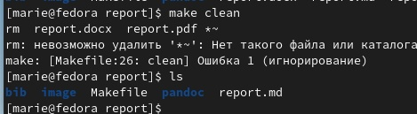

---
## Front matter
title: "Лабораторная работа №4."
subtitle: "Дисциплина: Архитектура Компьютера"
author: "Извекова Мария Петровна, гр. НКАбд-01-22, студ. 1132226460"

## Generic otions
lang: ru-RU
toc-title: "Содержание"

## Bibliography
bibliography: bib/cite.bib
csl: pandoc/csl/gost-r-7-0-5-2008-numeric.csl

## Pdf output format
toc: true # Table of contents
toc-depth: 2
lof: true # List of figures
lot: true # List of tables
fontsize: 12pt
linestretch: 1.5
papersize: a4
documentclass: scrreprt
## I18n polyglossia
polyglossia-lang:
name: russian
options:
- spelling=modern
- babelshorthands=true
polyglossia-otherlangs:
name: english
## I18n babel
babel-lang: russian
babel-otherlangs: english
## Fonts
mainfont: PT Serif
romanfont: PT Serif
sansfont: PT Sans
monofont: PT Mono
mainfontoptions: Ligatures=TeX
romanfontoptions: Ligatures=TeX
sansfontoptions: Ligatures=TeX,Scale=MatchLowercase
monofontoptions: Scale=MatchLowercase,Scale=0.9
## Biblatex
biblatex: true
biblio-style: "gost-numeric"
biblatexoptions:
- parentracker=true
- backend=biber
- hyperref=auto
- language=auto
- autolang=other*
- citestyle=gost-numeric
## Pandoc-crossref LaTeX customization
figureTitle: ""
tableTitle: "Таблица"
listingTitle: "Листинг"
lofTitle: "Список иллюстраций"
lotTitle: "Список таблиц"
lolTitle: "Листинги"
## Misc options
indent: true
header-includes:
- \usepackage{indentfirst}
- \usepackage{float} # keep figures where there are in the text
- \floatplacement{figure}{H} # keep figures where there are in the text
---

# Задание

1. Скачать и установить texlive.
2. Скачать и установить pandoc, pandoc-crossref.
3. Провести компиляцию шаблона с использованием Makefile.
4. Удалил полученный файлы с использованием Makefile.
5. Сделать отчёт по третьей лабораторной в формате markdown.
6. Загрузил файлы на github.

# Теоретическое введение

Например, в табл. [-@tbl:std-dir] приведено краткое описание стандартных команд markdown.

: Kраткое описание стандартных команд markdown {#tbl:std-dir}

**Команда** | **Что выполняет**
------------|------------------
`#Заголовок 1`|#Заголовок 1
`## Заголовок 3` |## Заголовок 2
`### Заголовок 3` |### Заголовок 3
`#### Заголовок 4` |#### Заголовок 4
`*Текст курсивом*`|*Текст курсивом*
`**Жирный текст** `|**Жирный текст**
`~~Зачеркнутый текст~~ `|~~Зачеркнутый текст~~
`code` |
`[Текст ссылки](URL_ссылки)`|[ТУИС](https://esystem.rudn.ru/)

# Выполнение лабораторной работы

1.  Через теpминал скачиваем и устанавливаем TeX Live (рис. [-@fig:001], рис. [-@fig:002]), Pandoc и pandoc-crossref (рис. [-@fig:003]). 

{#fig:001 width=70%} 

{#fig:002 width=70%}

{#fig:003 width=70%} 

2.  Перейдем в каталог курс, сформированный при выполнении лабораторной работы №3 (рис. [-@fig:004])

![рис. 4] (image/cd.jpg){#fig:004 width=70%}

С помощью команды *git pull* обновляем локальный репозиторий (рис.  [-@fig:005])

![рис. 5] (image/git.jpg){#fig:005 width=70%}

Далее переходим в каталон с шаблоном отчета по лр №4. После проводим компиляцию шаблона с использованием Makefile с помощью команды *make* (рис [-@fig:006])

![рис. 6] (image/make.jpg){#fig:006 width=70%}

У нас сгенерировались файлы report.pdf и report.docx. Проверяем их командой *ls*.(рис [-@fig:007])

{#fig:007 width=70%}

Далее удаляем полученный файлы с помощью команды *make clean* (рис 8 [-@fig:008])

{#fig:008 width=70%}

Открываем файл *report.md* с помощью текстового редактора *gedit*. Здесь заполняем отчет с использованием Makefile (рис 9 [-@fig:009])

{#fig:009 width=70%}

Загружаем файл на Githhub

# Выводы

В процессе выполнения ЛР№4 мы ознакомились с такой языковой разметкой как Markdown, с помощью которого мы оформили отчет данной работы, а также ЛР№3.
# Список литературы{.unnumbered}

::: {#refs}
:::
