---
## Front matter
title: "Отчет по лабораторной работе №7"
subtitle: "Дисциплина архитектура компьютера"
author: "Извекова Мария Петровна"

## Generic otions
lang: ru-RU
toc-title: "Содержание"

## Bibliography
bibliography: bib/cite.bib
csl: pandoc/csl/gost-r-7-0-5-2008-numeric.csl

## Pdf output format
toc: true # Table of contents
toc-depth: 2
lof: true # List of figures
lot: true # List of tables
fontsize: 12pt
linestretch: 1.5
papersize: a4
documentclass: scrreprt
## I18n polyglossia
polyglossia-lang:
  name: russian
  options:
	- spelling=modern
	- babelshorthands=true
polyglossia-otherlangs:
  name: english
## I18n babel
babel-lang: russian
babel-otherlangs: english
## Fonts
mainfont: PT Serif
romanfont: PT Serif
sansfont: PT Sans
monofont: PT Mono
mainfontoptions: Ligatures=TeX
romanfontoptions: Ligatures=TeX
sansfontoptions: Ligatures=TeX,Scale=MatchLowercase
monofontoptions: Scale=MatchLowercase,Scale=0.9
## Biblatex
biblatex: true
biblio-style: "gost-numeric"
biblatexoptions:
  - parentracker=true
  - backend=biber
  - hyperref=auto
  - language=auto
  - autolang=other*
  - citestyle=gost-numeric
## Pandoc-crossref LaTeX customization
figureTitle: "Рис."
tableTitle: "Таблица"
listingTitle: "Листинг"
lofTitle: "Список иллюстраций"
lotTitle: "Список таблиц"
lolTitle: "Листинги"
## Misc options
indent: true
header-includes:
  - \usepackage{indentfirst}
  - \usepackage{float} # keep figures where there are in the text
  - \floatplacement{figure}{H} # keep figures where there are in the text
---

# Цель работы

Освоение арифметических инструкций языка ассемблера NASM

# Задание

1. Символьные и численные данные в NASM
2. Выполнение арифметических операций в NASM
3. Выполнение заданий для самостоятельной работы

# Теоретическое введение

Большинство инструкций на языке ассемблера требуют обработки операндов.
Адрес операнда предоставляет место, где хранятся данные, подлежащие обработке. Это могут быть данные хранящиеся в регистре или в ячейке памяти. Далее рассмотрены все существующие способы задания адреса хранения операндов – способы адресации.
Существует три основных способа адресации:
• Регистровая адресация – операнды хранятся в регистрах и в команде
используются имена этих регистров, например: mov ax,bx.
• Непосредственная адресация – значение операнда задается непосредственно в команде, Например: mov ax,2.
• Адресация памяти– операнд задает адрес в памяти. В команде указывается символическое обозначение ячейки памяти, над содержимым которой требуется выполнить операцию.

# Выполнение лабораторной работы

## Символьные и численные данные в NASM

1. Переходим в каталог для программ Лабораторной работы №7, создаем файл lab7-1.asm и с помощью функции gedit открываем этот файл для редактирования (рис. [-@fig:001])

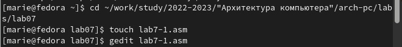{ #fig:001 width=70% }

2. В этот файл вставляем текст из файла in_out.asm для вывода символьных и численных значений. Программы будут выводить значения записанные в регистр eax.(рис. [-@fig:002])

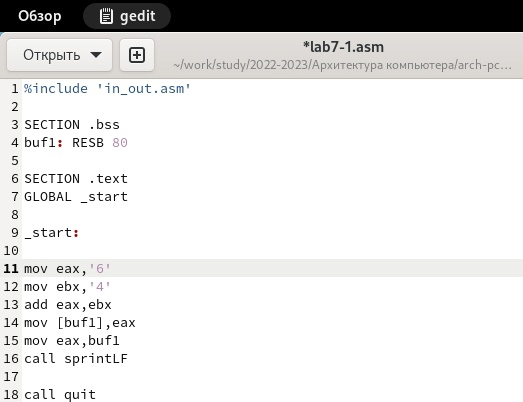{ #fig:002 width=70% }

3. Запускаем файл с помощью следующих команд (рис. [-@fig:003]) выводим значение. Мы получаем значение j.

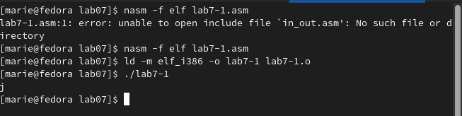{ #fig:003 width=70% }

4. Далее изменим текст программы и вместо символов, запишем в регистры числа. Исправляем текст программы из рисунка 2 следующим образом:
замените строкит mov eax,'6', mov ebx,'4'
на строки mov eax,6 , mov ebx,4 (рис. [-@fig:004])

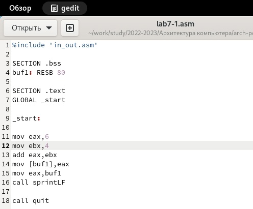{ #fig:004 width=70% }

5. Создаем файл и запускаем его с помощью команд. Выводится символ с кодом 10, который не отображается на экране. (рис. [-@fig:005])

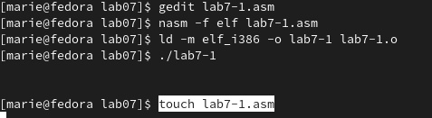{ #fig:005 width=70% }

6. Создаем новый файл lab7-2.asm и вставляем исправленный текст из рисунка 2. Создаем файл и запускаем его. В данном случае выводится цифра 106, так как функция iprintLF позволяет вывести
число, а не символ, кодом которого является это число.(рис. [-@fig:006] - [-@fig:007])

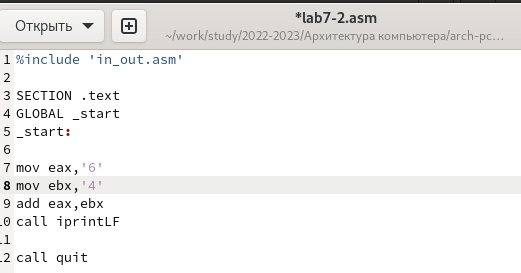{ #fig:006 width=70% }

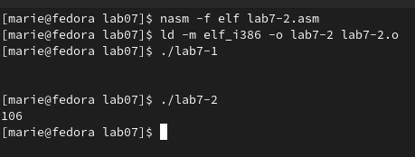{ #fig:007 width=70% }

7. Аналогично предыдущему примеру изменяем символы на числа. Заменяем строки mov eax,'6', mov ebx,'4'
на строки mov eax,6, mov ebx,4 .
Создаем исполняемый файл и запускаем его. (рис. [-@fig:008])

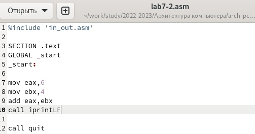{ #fig:008 width=70% }

8. В данном случае выводится цифра 10 (рис. [-@fig:009])

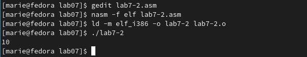{ #fig:009 width=70% }

9. Заменяем функцию iprintLF на iprint. Создаем исполняемый файл и запускаем его. (рис. [-@fig:010] - [-@fig:011])

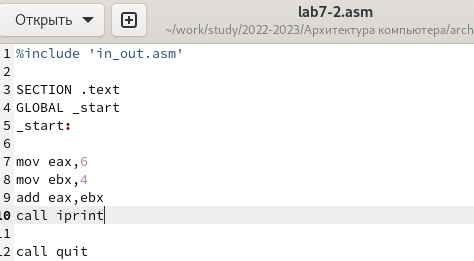{ #fig:010 width=70% }

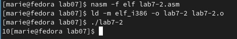{ #fig:011 width=70% }

## Выполнение арифметических операций в NASM

1. В качестве примера выполнения арифметических операций в NASM приведем программу вычисления арифметического выражения 𝑓(𝑥) = (5 ∗ 2 + 3)/3.
Создаем файл lab7-3.asm в каталоге ~/work/arch-pc/lab07 и открываем его с помощью редактора (рис. [-@fig:012])

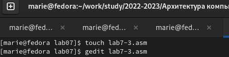{ #fig:012 width=70% }

2. В этот файл вставляем следующий текст (рис. [-@fig:013])

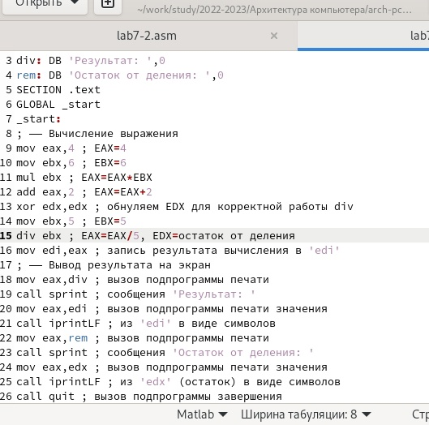{ #fig:013 width=70% }

3. Создаем файл и запускаем его. Результат работы следующий: (рис. [-@fig:014])

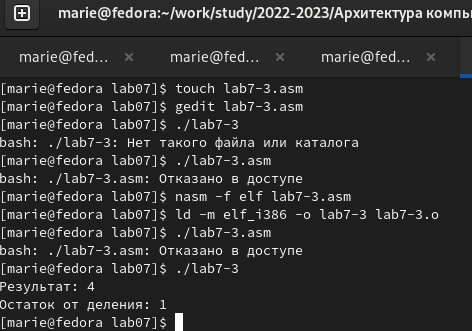{ #fig:014 width=70% }

4. Изменяем текст программы для вычисления выражения 𝑓(𝑥) = (4 ∗ 6 + 2)/5.
Создаем исполняемый файл и проверяем его работу. (рис. [-@fig:015] - [-@fig:016])

{ #fig:015 width=70% }

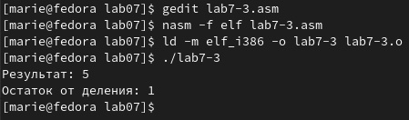{ #fig:016 width=70% }

5. В качестве другого примера рассмотрим программу вычисления варианта задания по номеру студенческого билета. Создаем файл variant.asm в каталоге ~/work/arch-pc/lab07 с помощью команды touch. В этот файл вводим следующий текст  (рис. [-@fig:017])

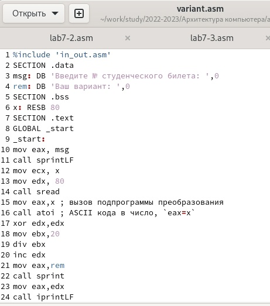{ #fig:017 width=70% }

6. Проверяем работу, ввожу номер студенческого билета, он выводит номер варианта(рис. [-@fig:018]).

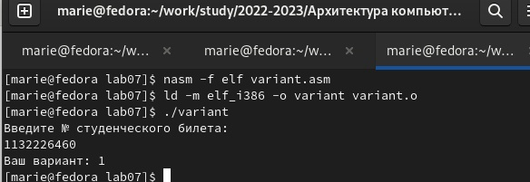{ #fig:018 width=70% }

## Ответы на вопросы по программе
1. За вывод сообщения "Ваш вариант" отвечают строки кода:
mov eax,rem
call sprint
2. Инструкция mov ecx, x используется, чтобы положить адрес вводимой строки x в регистр ecx mov edx, 80 - запись в регистр edx длины вводимой строки call sread - вызов подпрограммы из внешнего файла, обеспечивающей ввод сообщения с клавиатуры

3. call atoi используется для вызова подпрограммы из внешнего файла, которая преобразует ascii-код символа в целое число и записывает результат в регистр eax

4. За вычисления варианта отвечают строки:

xor edx,edx ; обнуление edx для корректной работы div
mov ebx,20 ; ebx = 20
div ebx ; eax = eax/20, edx - остаток от деления
inc edx ; edx = edx + 1

5. При выполнении инструкции div ebx остаток от деления записывается в регистр edx

6. Инструкция inc edx увеличивает значение регистра edx на 1

7. За вывод на экран результатов вычислений отвечают строки:

mov eax,edx
call iprintLF

## Самостоятельная работа
Вариант 1, вычисление (10 + 2𝑥)/3

1. создаем файл lab4-1.asm, открываем его с помощью редактора gedit и вставляем следующий текст (рис. [-@fig:019] - [-@fig:020])

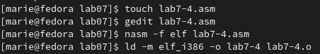{ #fig:019 width=70% }

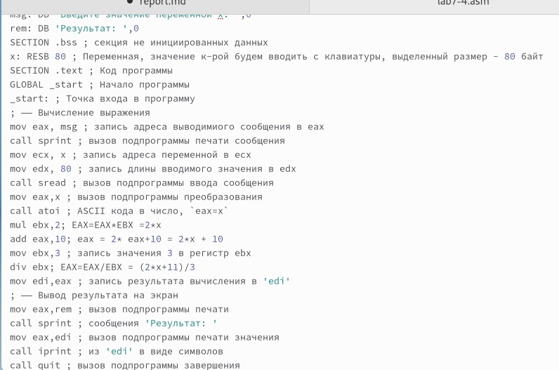{ #fig:020 width=70% }

2. Создаем и запускаем файл. Получаем следующие результаты: (рис. [-@fig:021] - [-@fig:022])

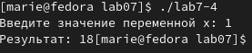{ #fig:021 width=70% }

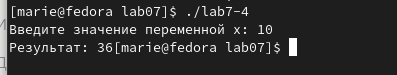{ #fig:022 width=70% }

# Выводы

При выполнении данной лабораторной работы я освоила арифметические инструкции языка ассемблера NASM.

# Список литературы{.unnumbered}

1. Лабораторная работа №7
2. Таблица ASCII
